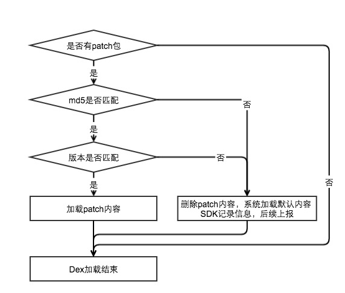

# Android-HoxFix-SDK-Native-Java（Android 上SDK的代码热更方案）

## 〇、更新记录

2016-04-29：完成demo代码和文档大纲。

2016-10-26：完成文档介绍、Demo运行方式整理、增加补丁包的生成等方法。

## 一、项目介绍

继插件化后，热补丁技术在2015年开始爆发，目前已经是非常热门的Android开发技术。关于热更新以及这些方案的优缺点，之前微信团队已经分享过，而且分析的很好，因此这里就不重点介绍了。感兴趣的同学可以点击了解：[微信Android热补丁实践演进之路](http://mp.weixin.qq.com/s?__biz=MzAwNDY1ODY2OQ==&mid=2649286306&idx=1&sn=d6b2865e033a99de60b2d4314c6e0a25&mpshare=1&scene=1&srcid=10266hBPguvWvTgHybtNDiCy#rd)

目前的热更新方案中比较著名的有淘宝的Dexposed、支付宝的AndFix以及Qzone的multidex和微信的tinker。然而这些热更新方案基本上都有以下两个特点：

1. 都是APP级别的的热更新解决方案，对于SDK的开发者来说很多地方需要一些调整
2. 在理解、开发上成本都比较高；而且很多更多的是方案的推广。

因此为了解决SDK的热更新方案，也为了方便大家了解Android热更新，因此开发这个项目。

### 一些说明

**该项目主要是提供给SDK的开发者使用，提供了SDK开发者如何实现SDK自身热更新（包括Java代码和Native），如果是APP的开发者了解应用的热更新，建议参考dodola的HotFix项目，里面介绍的更全面。**

**为了降低项目的理解难度，关于java热更新，该项目暂时不会涉及怎么管理版本号、怎么在代码中插桩、怎么生成版本差异包、怎么将差异包编为dex文件等内容，这部分内容我会在另外的项目来介绍。**

**为了降低项目的理解难度，关于so的热更新，该项目暂时仅使用arm的so，关于如何在热更时根据so的类型来选择下发什么类型的so，请参考作者之前的文章 [SDK热更之如何获取应用在当前设备上的so对应的指令集
](http://blog.bihe0832.com/SDK_hotfix_so_abi.html)。**

**由于本项目重点介绍重点SDK的热更新相关的内容，因此项目中的代码虽然是实现简单的功能，但是使用了SDK和demo等多个项目以及java和Native多层调用。**本项目中不会再介绍SDK相关的内容，建议可以先通过下面的链接了解这个项目的结构，然后再看热更新项目的内容，[点击了解Android-gradle-jni-so](https://github.com/bihe0832/Android-gradle-jni-so)。

该项目是基于QQ空间终端开发团队的技术文章实现的，然后补充了Native的So的动态加载相关的内容。文章地址：[安卓App热补丁动态修复技术介绍](http://zhuanlan.zhihu.com/magilu/20308548)

项目代码前期有参考dodola的HotFix项目，项目地址为：[https://github.com/dodola/HotFix](https://github.com/dodola/HotFix)

## 二、体验Demo

### 1. APK及补丁生成

####（1）. 直接下载：

直接下载的方式，补丁包已经放在作者的服务器，体验时直接下载安装APK即可。
	
- [点击下载](http://blog.bihe0832.com/public/resource/Hotfix-debug.apk)
	
- 扫码下载APK：
	

#### （2）. 运行项目生成：

1. 生成支持热更的SDK

	- 修改MD5下local.properies中的ndk.dir和sdk.dir的环境配置
	- 修改MD5下gradle/wrapper/gradle-wrapper.properties 关于使用的gradle版本的地址的修改
	- 修改MD5下build.gradle中对于使用的maven库的声明
	- 修改MD5下HotFixConsts中关于热更补丁下载地址的配置：`PATCH_DOWNLOAD_URL`，建议其余配置不要修改
	- 在整个根目录执行命令 `/bin/bash ./build.sh md5`
	- 执行命令结束以后，根目录bin目录会生成如下文件
	
			└── MD5
			    │
			    ├── bihe0832MD5.jar ：支持热更的SDK的版本
			    │
			    ├── bihe0832MD5_old.jar ：SDK编译生成的原始jar
			    │
			    ├── armeabi
			    │		│
			    │		└─── libbihe0832MD5.so ：arm指令集下的so文件
			    │
			    └── …… 其余so文件，因为我们仅关注arm，因此忽略其余的指令集

2. 生成集成了支持热更的SDK的apk

	- 修改GradleTest下local.properies中的ndk.dir和sdk.dir的环境配置
	- 修改GradleTest下gradle/wrapper/gradle-wrapper.properties 关于使用的gradle版本的地址的修改
	- 修改GradleTest下build.gradle中对于使用的maven库的声明
	- 拷贝步骤1生成的支持热更的SDK的jar文件bihe0832MD5.jar到GradleTest项目下app目录中的libs目录下
	- 拷贝步骤1生成的armeabi文件夹到GradleTest项目下app目录的src/main/jniLibs下
	- 运行项目，生成apk文件

3. 生成热更使用的补丁包

	- 修改MD5项目目录下FixInfo中的VERSION_NAME、VERSION_CODE、测试热更的bug函数
	- 修改MD5项目目录下MD5文件中的getLowerMD5函数的bug
	- 修改MD5项目目录下com_bihe0832_md5_MD5.cpp中的VERSION
	- 修改根目录下build.sh中使用的build-tool的版本（`$ANDROID_HOME/build-tools/23.0.2/dx --dex ……`），例如默认使用的为23.0.2
	- 在整个根目录执行命令 `/bin/bash ./build.sh patch`
	- 执行命令结束以后，根目录bin目录会生成Patch目录，如下：

			└── Patch
			    │
			    ├──  armeabi
			    │		│
			    │		└─── libbihe0832MD5.so ：arm指令集下的更新的so文件
			    │
			    ├── bihe0832_patch.jar ：需要通过热更修复的相关代码class文件
			    │
			    └── bihe0832_patch_dex.jar ：需要通过热更修复的相关代码的dex文件

4. 配置补丁
	
	- 将So和patch上传到对应的服务器地址，**切记不要修改名称**

### 2. 体验方法

1. 安装本文提供或者自己运行工程生成的apk文件，然后体验功能，重点看日志中的版本号变化和输入任意字符的大小写md5。事例如下：

		10-26 16:27:36.544 17093-17093/? D/bihe0832 Hotfix: version_name:1.0.0
		10-26 16:27:36.544 17093-17093/? D/bihe0832 Hotfix: version_code:1
		10-26 16:27:36.544 17093-17093/? D/bihe0832 Hotfix: onCreate
		10-26 16:27:36.544 17093-17093/? D/bihe0832 Hotfix: checkFileExist
		10-26 16:27:36.544 17093-17093/? D/bihe0832 Hotfix: File not found
		10-26 16:27:36.544 17093-17093/? D/bihe0832 Hotfix: loadLibsSo
		10-26 16:27:36.544 17093-17093/? D/bihe0832 Hotfix: checkJarInFileExist
		10-26 16:27:36.544 17093-17093/? D/bihe0832 Hotfix: File not found
		10-26 16:27:36.544 17093-17093/? D/bihe0832 MySDKInnerApi: onCreate
		10-26 16:27:36.544 17093-17093/? D/bihe0832 MD5: com.bihe0832.hotfix.Fix
		10-26 16:27:36.544 17093-17093/? D/bihe0832 MD5: MD5 version name:1.0.0
		10-26 16:27:36.544 17093-17093/? D/bihe0832 MD5: MD5 version code:1
		10-26 16:27:36.544 17093-17093/? D/bihe0832 MD5: MD5 CPP version code:1
		10-26 16:27:41.334 17093-17093/com.bihe0832.hotfixdemo D/bihe0832 MySDKInnerApi: testHotfix
		10-26 16:27:41.334 17093-17093/com.bihe0832.hotfixdemo D/bihe0832 MD5: com.bihe0832.hotfix.Fix
		10-26 16:27:41.334 17093-17093/com.bihe0832.hotfixdemo D/bihe0832 Hotfix: bug class
		10-26 16:27:41.344 17093-17093/com.bihe0832.hotfixdemo D/bihe0832 Gradle: getUserInput:fsfddsfsdf
		10-26 16:27:41.344 17093-17093/com.bihe0832.hotfixdemo D/bihe0832 MySDKInnerApi: getUpperMD5
		10-26 16:27:41.344 17093-17093/com.bihe0832.hotfixdemo D/bihe0832 Gradle: showResult:DBBCF8D34E9FB98A67B7DBFAFA9437AA
		10-26 16:27:42.204 17093-17093/com.bihe0832.hotfixdemo D/bihe0832 MySDKInnerApi: testHotfix
		10-26 16:27:42.204 17093-17093/com.bihe0832.hotfixdemo D/bihe0832 MD5: com.bihe0832.hotfix.Fix
		10-26 16:27:42.204 17093-17093/com.bihe0832.hotfixdemo D/bihe0832 Hotfix: bug class
		10-26 16:27:42.204 17093-17093/com.bihe0832.hotfixdemo D/bihe0832 Gradle: getUserInput:fsfddsfsdf
		10-26 16:27:42.204 17093-17093/com.bihe0832.hotfixdemo D/bihe0832 MySDKInnerApi: getLowerMD5
		10-26 16:27:42.204 17093-17093/com.bihe0832.hotfixdemo D/bihe0832 Gradle: showResult:DBBCF8D34E9FB98A67B7DBFAFA9437AA

2. 点击界面按钮出发热更新文件下载
- 热更新内容下载完成以后，会有toast，收到toast以后，重启应用然后体验功能，重点看日志中的版本号变化和输入任意字符的大小写md5。事例如下：

		10-26 16:29:58.804 19691-19691/? D/bihe0832 Hotfix: version_name:1.0.0
		10-26 16:29:58.804 19691-19691/? D/bihe0832 Hotfix: version_code:1
		10-26 16:29:58.804 19691-19691/? D/bihe0832 Hotfix: onCreate
		10-26 16:29:58.804 19691-19691/? D/bihe0832 Hotfix: checkFileExist
		10-26 16:29:58.804 19691-19691/? D/bihe0832 Hotfix: File exists:/data/data/com.bihe0832.hotfixdemo/files/libbihe0832MD5.so
		10-26 16:29:58.804 19691-19691/? D/bihe0832 Hotfix: loadFilesSo
		10-26 16:29:58.814 19691-19691/? D/bihe0832 Hotfix: checkJarInFileExist
		10-26 16:29:58.814 19691-19691/? D/bihe0832 Hotfix: File exists:/data/data/com.bihe0832.hotfixdemo/files/bihe0832_patch_dex.jar
		10-26 16:29:58.814 19691-19691/? D/bihe0832 Hotfix: loadClassFromJar
		10-26 16:29:58.814 19691-19691/? D/bihe0832 MySDKInnerApi: onCreate
		10-26 16:29:58.814 19691-19691/? D/bihe0832 MD5: com.bihe0832.hotfix.Fix
		10-26 16:29:58.814 19691-19691/? D/bihe0832 MD5: MD5 version name:1.0.1
		10-26 16:29:58.814 19691-19691/? D/bihe0832 MD5: MD5 version code:2
		10-26 16:29:58.814 19691-19691/? D/bihe0832 MD5: MD5 CPP version code:2
		10-26 16:30:00.904 19691-19691/com.bihe0832.hotfixdemo D/bihe0832 MySDKInnerApi: testHotfix
		10-26 16:30:00.904 19691-19691/com.bihe0832.hotfixdemo D/bihe0832 MD5: com.bihe0832.hotfix.Fix
		10-26 16:30:00.904 19691-19691/com.bihe0832.hotfixdemo D/bihe0832 Hotfix: fixed class
		10-26 16:30:00.904 19691-19691/com.bihe0832.hotfixdemo D/bihe0832 Gradle: getUserInput:fsfddsfsdf
		10-26 16:30:00.904 19691-19691/com.bihe0832.hotfixdemo D/bihe0832 MySDKInnerApi: getUpperMD5
		10-26 16:30:00.904 19691-19691/com.bihe0832.hotfixdemo D/bihe0832 Gradle: showResult:DBBCF8D34E9FB98A67B7DBFAFA9437AA
		10-26 16:30:01.564 19691-19691/com.bihe0832.hotfixdemo D/bihe0832 MySDKInnerApi: testHotfix
		10-26 16:30:01.564 19691-19691/com.bihe0832.hotfixdemo D/bihe0832 MD5: com.bihe0832.hotfix.Fix
		10-26 16:30:01.564 19691-19691/com.bihe0832.hotfixdemo D/bihe0832 Hotfix: fixed class
		10-26 16:30:01.564 19691-19691/com.bihe0832.hotfixdemo D/bihe0832 Gradle: getUserInput:fsfddsfsdf
		10-26 16:30:01.564 19691-19691/com.bihe0832.hotfixdemo D/bihe0832 MySDKInnerApi: getLowerMD5
		10-26 16:30:01.564 19691-19691/com.bihe0832.hotfixdemo D/bihe0832 Gradle: showResult:dbbcf8d34e9fb98a67b7dbfafa9437aa

## 三、代码介绍

### 1. 工程介绍

	Android-HoxFix-SDK-Native-Java
		│
		├─── DemoRes 目前线上的demo使用的相关补丁内容
		│
		├─── MD5 SDK项目的工程，最终打包后对外提供jar包和so，本项目主要也是介绍他的热更新
		│
		├─── GradleTest 普通的Android应用工程，调用了SDK提供的相关函数，也就是SDK的使用者
		|
		├─── build.sh 生成SDK的jar和so，生成Demo对应的补丁文件、生成Demo Apk的自动构建脚本
		│
	   	└─── README.md 项目介绍

#### 备注：后面的内容都重点介绍整个热更新相关的内容，这里补充一下目前的demo项目存在的一些注意事项。

1. SDK的生成只能用命令行，因为分包生成支持热更的SDK是通过shell脚本实现的，直接gradle生成的jar并不可用
2. Demo中，下载更新直接在主线程，而且没有回调，这里可以优化，因为为了介绍热更，因此对这里没有做太复杂的处理

### 2. 关键文件介绍

#### 默认patch

对应本项目，就是bihe0832_hackdex.jar，是一个dex文件，里面仅包含插桩用的com.bihe0832.hotfix.Fix的代码。是解决预校验的关键类，需要打包进SDK的jar包，负责在Android的低版本会有问题。

### 3. 关键操作介绍

#### 默认patch生成

目前因为默认patch是固定的，因此是通过手动生成。主要包括以下几步

- 拿到SDK编译后的完整jar
- 解压jar、删除除com.bihe0832.hotfix.Fix以外的所有代码
- 将com.bihe0832.hotfix.Fix的class打包为jar
- 用build工具将jar生成为dex（方法与生成patch包方法一致）

#### 生成支持热更新的SDK 

默认生成的jar因为没有实现代码分包，因此会带来预校验的问题，因此我们需要对SDK代码分包，具体做法：

- 拿到SDK编译后的完整jar
- 解压jar，删除com.bihe0832.hotfix.Fix文件
- 把默认patch等其余热更需要的文件添加到jar的assets文件
- 把所有内容重新打成新的jar

#### 生成补丁包

Demo中关于补丁包的生成非常简单，是手动确认要删除那些文件来实现的（参见build.sh），后续介绍自动插桩的时候会介绍怎么自动生成，主要原理为：

- 拿到SDK编译后的完整jar
- 解压jar，删除com.bihe0832.hotfix.Fix文件
- 与老版本对比，删除所有没有变化的文件
- 把所有内容重新打成新的jar
- 用build工具将jar生成为dex

### 4. SDK初始化及热更流程

**为了保证尽可能多的SDK的代码可以通过热更新更新，因此SDK通过先初始化热更模块，然后再初始化SDK的方法，而且比较多的使用了反射来杜绝代码引用引起的无法热更。**

- **SDK初始化简单流程**

## 四、待优化点

**这里主要介绍本项目没有添加进来但是热更相关的项目必须要考虑到的一些关注点，可以说都并非是待优化点，而是正式线上项目必须需要实现的基本功能。由于这部分内容与热更原理关系不大，而且不同项目差异性比较大，因此不在这里重点说明，后续会通过系列文章来介绍**

### 1. 关于安全
	
- **热更内容下发通道**

	怎么保证热更内容下发的安全性，保证下发的热更时自己的后台而且被劫持的后台下发

- **加载热更新前没有验证合法性**

	Demo中热更前没有校验热更文件的合法性，怎么保证加载的热更patch包时自己后台下发的，而不是第三方篡改过的非法patch

- **没有做版本匹配**

	热更新既然是更新，肯定有原始版本，怎么保证下发的patch包只有指定的版本可以加载，其余版本不会加载。这里包括

	- 怎么保证后台不会下发
	- 怎么保证即使后台下发了客户端也不会加载

- **没有odex校验**

	这个我们的SDK没有考虑，因为如果可以替换odex，其实已经拿到了root权限，他其实可以做更多，所有的策略都会失效。

-  **怎么回滚**

	SDK的热更新如果遇到异常，怎么回退来降低风险，不让热更变为制造灾难的最后一根稻草

### 2. 关于SO的更新

目前的demo中只使用了arm的so，所以热更，但是SDK肯定要提供完整的SO，当需要提供完整的so的时候，怎么下发正确的so？这个问题可以参考作者之前的文章：[SDK热更之如何获取应用在当前设备上的so对应的指令集
](http://blog.bihe0832.com/SDK_hotfix_so_abi.html)

### 3. 关于运营维护

- **热补丁和版本的匹配怎么维护**

	如果热补丁用来做功能发布的话，SDK版本和热补丁之前如果匹配就会很复杂，如果维护两者的对应关系？

- **热更相关的数据上报**

	热更新因为涉及到功能和bug修复，而且是关键逻辑，他发布以后就会立即生效，因此相关的crash数据、更新次数、成功率、异常问题问题统计等，怎么保证这些数据可以实时发现和查看

- **怎么控制热更发布**

	热更新因为涉及到功能和bug修复，而且是关键逻辑，他发布以后就会立即生效，因此他的发布流程就会比较重要，涉及到热更版本的测试要测试哪些内容、灰度发布的策略等。
	

五、其他

这里附上我们目前SDK的初始化时的流程图

- **SDK初始化详细流程**

- **增量内容加载详细流程**

